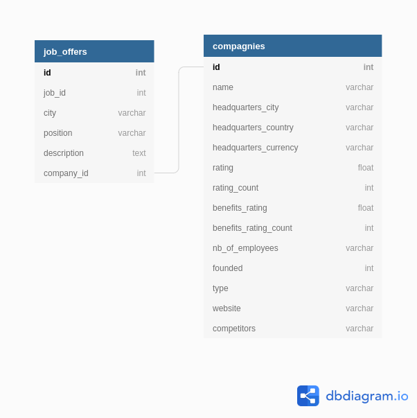

<!-- ABOUT THE PROJECT -->
## About The Project

The project :
**To get informations about companies: salary , advantages, rating, adress, headquarters ... 
In purpose to have a complete 
documentation for person who need to know some things about a company.**

The database ERD:





<!-- GETTING STARTED -->
## Getting Started

Project Link: https://github.com/AxelStbl/data_scrapping_project  

### Prerequisites

* []()To run the project => you need to run the 'python -m scrapping'.
* []()Parameters: HEADLESS, QUIT, SAVED_DATA, RECAP, JOB, BASE_URL and LOGGING_LEVEL.
* []()HEADLESS: To scrape data in headless mode on Firefox (by default it is False)
* []()QUIT: To quit the program (By defaut it is True)
* []()SAVED_DATA: To enter the name of the folder to save the data (by default 'saved_data')
* []()RECAP: To display all the job offers again at the end of the program. (By defaut it is True)
* []()JOB: To enter the job we want to scrap (By default 'ACTUARY')
* []()BASE_URL : It creates the url with the job who has entered
* []()LOGGING_LEVEL: By default logging.ERROR

### Installation
* []()Anaconda environment with python 3.6
* []()Selenium
* []()BeautifulSoup
* []()Firefox installed
* []()MySql
* []()mysql-connector-python
* []()Run this in local if you want to execute the databases with the provided data configuration :   
```sql
GRANT ALL PRIVILEGES ON *.* TO 'username'@'localhost' IDENTIFIED BY 'password';
```
If you have a more recent version of SQL:  
```sql
CREATE USER 'username'@'localhost' IDENTIFIED BY PASSWORD 'password';
GRANT ALL ON *.* TO 'username'@'localhost';
```
 and then to insert data :  
 ```bash
 mysql -u username -p < scrapping/conf/database_creation.sql 
```

Another solution is to configure your mysql account
in connector_db.py and set the password and username it has to have
select and insert rights at least


